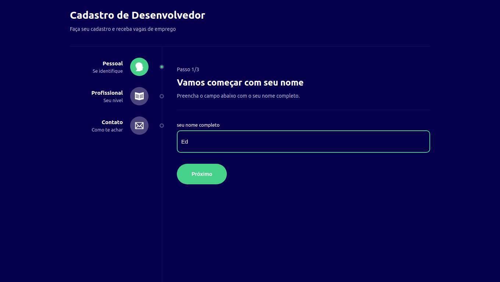
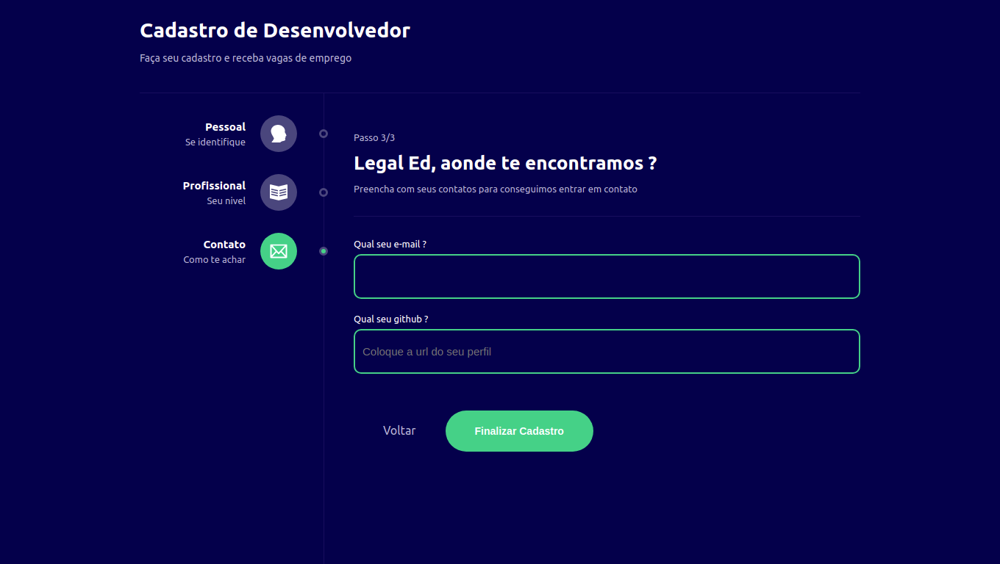

# Fórmulario multi etapas
### Teste o projeto acessando o site
https://edgomes-dev.github.io/multiform-react/

# Layout Desktop

  
  
  

# Layout Mobile

  
  
  
  

# Sobre este  projeto
A ideia do App é:

"Um formulário, que possui multi etapas. Aonde o usuário pode voltar e avançar em cada etapa, porém o estado(valor) não será mudado".

# Algumas informações sobre este Website

1 - Este projeto, tem apenas a funcionalidade de mostrar o layout e gerenciamento de estado.

# Funcionalidades

* Pega as informações inseridas pelo usuário e guarda elas, só alterando quando o mesmo faz essa alteração.
* As informações ficam salva no estado, mesmo que ela volte para a etapa anterior, essa informação permanecerá guardada.

# Construido com:
* Typescript - Foi utilizado por ser uma versão tipada do javascript, o que ajuda na hora de receber dados, evitando receber dados invalidos. Além de ser melhor na hora de realizar manutenção e na construção do sistema é bem mais prático e evita erros.
* React - Utilizada para fazer a construção do front-end, reaproveitando código com components e ser mais perfórmatico com renderização SPA.
* React-router-dom - Utilizado para o gerenciamentos das rotas
* Styled-components - Utilizado para estilizar, aplicando os estilos css. 
* Context-React - Utilizado para gerenciar o estado da aplicação.
* gh-pages - Utilizado para colocar o site no ar com o github pages, criando uma build e subindo para o servidor com apenas um comando.
